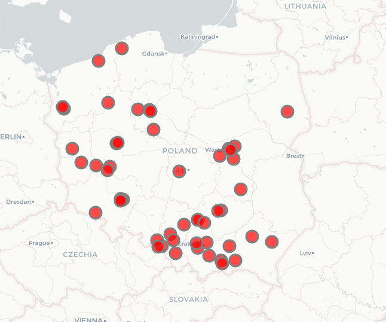

# customer_map
Customer map 
## Table of contents
* [General info](#general-info)
* [Technologies](#technologies)
* [Another functionality](#another-functionality)

## General info
This project is simple customer map generator.
The project previously searches and saves folders containing company names.
Then, using the GoogleMaps API, it searches for addresses and geographic coordinates of individual companies. 
Using OpenStreetMap maps, the visualization of customers locations is generated and saved to the html file.

## Technologies
Project is created with:
* pandas >= 1.1.2
* folium >= 0.11.0
* googlemaps >= 4.4.23

## Another functionality
It will be introduced in future versions of the project:
* Possibility to generate the list directly from xlsx file
* The ability to add layers
